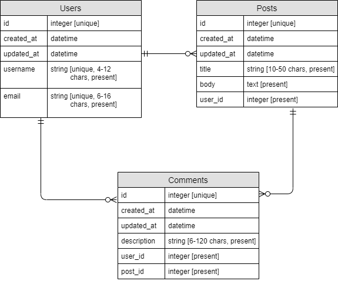

# Micro - Reddit

> A basic version of [Reddit](https://www.reddit.com/).

    

The porpuse of this project is build the data structures necessary to support link submissions and commenting for the [Reddit](https://www.reddit.com/) site.

## Built With

- Ruby on Rails 5.2.4

## Authors

👤 **Ivan Ulises Guzman Sanchez**

- Github: [@fivan18](https://github.com/fivan18)
- Twitter: [@fivanunam](https://twitter.com/fivanunam)
- Linkedin: [fivan](https://www.linkedin.com/in/fivan)

👤 **Remy Certil**

- Github: [@certilremy](https://github.com/certilremy)
- Twitter: [@certilremy](https://twitter.com/certilremy)
- Linkedin: [certilremy](https://linkedin.com/in/certilremy)

## 🤝 Contributing

Contributions, issues and feature requests are welcome!

Feel free to check the [issues page](https://github.com/fivan18/micro-reddit/issues).

## 📝 License

This project is [MIT]() licensed.
